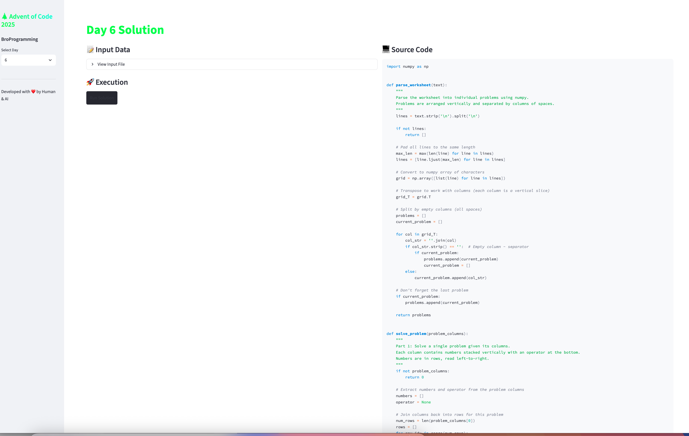

# Advent of Code 2025 🎄


My solutions for [Advent of Code 2025](https://adventofcode.com/2025) - a series of daily programming puzzles throughout December.

## 🚀 Interactive Dashboards

This project includes **fancy visualization tools** to explore the solutions!

### 1. 🖥️ Terminal Dashboard
Run the CLI runner for a beautiful terminal experience with progress bars and tables:

```bash
# Install dependencies first
pip install -r requirements.txt

# Run the dashboard
python main.py

# Run a specific day
python main.py 6
```

### 2. 🌐 Web Interface (Streamlit)
Launch the interactive web app to browse code, inputs, and AI analysis:

```bash
streamlit run app.py
```

### 3. 🧪 Regression Test Suite
Automatically test all solutions to ensure code changes don't break existing answers:

```bash
# Run all tests
python test_solutions.py

# Test a specific day
python test_solutions.py --day 6
```

The test suite:
- ✅ Verifies all solutions produce correct answers
- 📊 Shows results in a beautiful table
- 🚨 Alerts if any solution breaks
- 💾 Stores expected answers for comparison

## 🔄 CI/CD Pipeline

This project includes automated testing to prevent breaking changes:

### Local: Pre-push Git Hook
Automatically runs tests before every `git push`:

```bash
# One-time setup
./setup_hooks.sh

# Now tests run automatically before push
git push
```

**Features:**
- 🛡️ Blocks pushes if tests fail
- ⚡ Fast feedback before code reaches remote
- 🔓 Bypass if needed: `git push --no-verify` (not recommended)

### Remote: GitHub Actions
Continuous integration runs on every push and pull request:

- 🤖 Automatic test execution on GitHub
- ✅ Status badges show test results
- 🔍 Detailed logs for debugging failures
- 📧 Notifications on build failures

**Workflow:** `.github/workflows/test.yml`

**Preview:**



The web interface provides:
- 📁 Day selector in the sidebar
- 📝 Input data viewer with line count
- 🚀 One-click solution runner
- 💻 Syntax-highlighted source code display
- 🤖 AI analysis and algorithm explanations
- 🎨 Visual assets (images/animations) for each day

## Structure

Each day's solution is organized in its own directory:

```
dayX/
├── dayX.py          # Solution code
└── dayX_input.txt   # Puzzle input
```

## Solutions

### Day 1: Safe Dial Puzzle 🔐

A puzzle involving a circular dial numbered 0-99, starting at position 50.

**Part 1**: Count how many times the dial lands exactly on 0 after following rotation instructions.
- Instructions format: `R<distance>` (rotate right) or `L<distance>` (rotate left)
- The dial wraps around (modulo 100)

**Part 2**: Count how many times the dial passes through 0 during rotations, including when it lands on 0.
- Tracks all passes through position 0, not just final positions

#### Running Day 1

```bash
cd day1
python day1.py
```

### Day 2: Invalid ID Detection 🔢

A puzzle involving detecting invalid IDs based on pattern matching rules.

**Part 1**: Find IDs with the "mirror property" - where the first half of digits equals the second half.
- Example: `1010` (10|10), `446446` (446|446), `1188511885` (11885|11885)
- Only even-length numbers can have this property
- Sum all invalid IDs found in the given ranges

**Part 2**: Find IDs made of repeating patterns (at least twice).
- Example: `11` (1×2), `123123` (123×2), `565656` (56×3), `1111111` (1×7)
- Any sequence repeated 2+ times makes the ID invalid
- This catches more IDs than Part 1 (e.g., `111`, `565656`, `2121212121`)
- Sum all invalid IDs found in the given ranges

**Input Format**: Comma-separated ranges like `11-22,95-115,998-1012`
- Each range expands to all numbers between start and end (inclusive)

#### Running Day 2

```bash
cd day2
python day2.py
```

### Day 3: Battery Joltage Optimization 🔋

A puzzle about maximizing joltage output by selecting batteries from banks.

**Part 1**: Select exactly 2 batteries from each bank to maximize the 2-digit joltage.
- Example: From `987654321111111`, select batteries at positions 0,1 → `98` jolts
- Batteries must maintain their original order (cannot rearrange)
- Use greedy algorithm with suffix maximum tracking
- Time complexity: O(n) with single pass optimization
- Sum all maximum joltages across all banks

**Part 2**: Select exactly 12 batteries from each bank to maximize the 12-digit joltage.
- Example: From `234234234234278`, select 12 batteries → `434234234278` jolts
- Use monotonic stack with index tracking to greedily select largest digits
- Maintains original order by tracking (digit, index) pairs
- Algorithm removes smaller digits when larger ones appear later
- Time complexity: O(n), Space complexity: O(k) where k=12
- Sum all maximum joltages across all banks

**Key Algorithm**: Greedy monotonic stack
1. Calculate how many digits to remove: `n - k`
2. For each digit, remove smaller digits from stack if beneficial
3. Maintains indices to preserve original order
4. Example: `234234234234278` → skips first 3 digits to keep larger `4` at position 2

#### Running Day 3

```bash
cd day3
python day3.py
```

### Day 4: Paper Roll Accessibility 📦

A puzzle about determining which paper rolls can be accessed by forklifts based on neighbor density.

**Part 1**: Count rolls that can be accessed immediately.
- A roll (`@`) can be accessed if it has fewer than 4 adjacent rolls (out of 8 possible neighbors)
- Check all 8 directions: horizontal, vertical, and diagonal
- Simple neighbor counting - no graph algorithms needed
- Time complexity: O(rows × cols), Space: O(1)

**Part 2**: Simulate iterative removal process.
- Once accessible rolls are removed, more rolls may become accessible
- Continue removing newly accessible rolls until none remain
- This creates a cascading effect as neighbor counts decrease
- Example progression: 13 → 12 → 7 → 5 → 2 → 1 → 1 → 1 → 1 rolls removed
- Returns total number of rolls removed across all iterations

**Algorithm**: Iterative simulation
1. Find all rolls with < 4 adjacent rolls
2. Remove them all simultaneously (mark as `.`)
3. Recalculate which rolls are now accessible
4. Repeat until no more rolls can be removed

#### Running Day 4

```bash
cd day4
python day4.py
```

### Day 5: Fresh Ingredient Database 🥗

A puzzle about checking ingredient freshness using ID ranges.

**Part 1**: Count how many available ingredients are fresh.
- Input has two sections: fresh ID ranges, then available IDs
- An ingredient ID is fresh if it falls within any range (inclusive)
- Ranges can overlap - an ID is fresh if in ANY range
- Example: ID 17 is fresh because it's in both 16-20 and 12-18
- Simple range membership checking

**Part 2**: Count all unique IDs considered fresh by the ranges.
- Ignore the available IDs section
- Count total coverage of all fresh ranges
- Requires merging overlapping ranges to avoid double-counting
- Example: Ranges 10-14, 12-18, 16-20 → merged to 10-20 → 11 IDs

**Algorithm**: Interval merging
1. Sort ranges by start position
2. Merge overlapping ranges: if `start ≤ last_end + 1`, extend last range
3. Count IDs in all merged ranges: `sum(end - start + 1)`
4. Time complexity: O(n log n) for sorting, Space: O(n)

#### Running Day 5

```bash
cd day5
python day5.py
```

### Day 6: Cephalopod Math Worksheet 🧮

A puzzle about parsing and solving math problems arranged in an unusual horizontal layout.

**Part 1**: Solve problems reading left-to-right (rows).
- Numbers are arranged vertically in columns with operator at bottom
- Problems separated by columns of spaces
- Example: `123 * 45 * 6 = 33210` (read rows: 123, 45, 6)
- Uses NumPy for elegant grid transpose operation
- Supports `*` and `+` operators
- Sum all problem answers for grand total

**Part 2**: Solve problems reading right-to-left (columns) - Cephalopod math!
- Each **column** represents one number (digits read top-to-bottom)
- Process columns **right-to-left** instead of left-to-right
- Example: Same grid reads as `4 + 431 + 623 = 1058` from rightmost columns
- Added support for **modulo (%)** operator
- Complete reinterpretation of the same input data

**Key Insight**: Same grid, different reading direction = different answers!
```
123 328  51 64 
 45 64  387 23 
  6 98  215 314
*   +   *   +  

Part 1 (rows L→R): 33210 + 490 + 4243455 + 401 = 4,277,556
Part 2 (cols R→L): 1058 + 3253600 + 625 + 8544 = 3,263,827
```

**Algorithm**: Grid parsing with NumPy
1. Convert input to 2D character array with `np.array()`
2. Transpose grid with `grid.T` to access columns easily
3. Split by empty columns to separate problems
4. Extract numbers and operators based on reading direction
5. Evaluate and sum all results

#### Running Day 6

```bash
cd day6
python day6.py
```

### Day 7: Tachyon Manifold Beam Splitter ⚡

A puzzle about simulating beam propagation through a splitter grid.

**Part 1**: Count total beam splits in the tachyon manifold.
- Tachyon beams start at position `S` and move downward
- Empty space (`.`) allows beams to pass through
- Splitters (`^`) stop the beam and create two new beams (left and right)
- New beams also move downward from their starting positions
- Simulation continues until all beams exit the manifold
- Count how many times beams split

**Part 2**: Quantum many-worlds interpretation - count all possible timelines.
- Single particle takes BOTH paths at every splitter simultaneously
- Each split creates a new parallel timeline
- Count total distinct timelines when particle completes all journeys
- Two equivalent approaches implemented:
  1. **Top-down (DFS + memoization)**: Recursive with `@lru_cache`
  2. **Bottom-up (DP)**: Iterative row-by-row, `ways[r][c]` = particles at position
- Without optimization: O(2^n) exponential, With optimization: O(rows × cols)


#### Running Day 7

```bash
cd day7
python day7.py
```

## Requirements

- Python 3.x
- NumPy (for Day 6+)

Install dependencies:
```bash
pip install -r requirements.txt
```

## Usage

1. Clone this repository
2. Navigate to the specific day's directory
3. Run the Python script for that day
4. Solutions will print to the console

## Progress

| Day | Part 1 | Part 2 | Solution |
|-----|--------|--------|----------|
| 1   | ⭐     | ⭐     | [Python](day1/day1.py) |
| 2   | ⭐     | ⭐     | [Python](day2/day2.py) |
| 3   | ⭐     | ⭐     | [Python](day3/day3.py) |
| 4   | ⭐     | ⭐     | [Python](day4/day4.py) |
| 5   | ⭐     | ⭐     | [Python](day5/day5.py) |
| 6   | ⭐     | ⭐     | [Python](day6/day6.py) |
| 7   | ⭐     | ⭐     | [Python](day7/day7.py) |
| ... | ...    | ...    | ... |

## Notes

- Input files are specific to each user and are included in each day's directory
- Solutions prioritize clarity and correctness over performance (unless optimization is part of the challenge)

---

## About This Repository 🤖✨

This README and solutions were created with **AI pair programming**! 🚀

```
    🎄 Advent of Code 2025 🎄
         ╔═══════════╗
         ║  👨‍💻 + 🤖  ║
         ║ Human + AI ║
         ║   = 💪✨   ║
         ╚═══════════╝
    
    📊 Progress: 7/12 days (14 ⭐ earned)
    🔥 Streak: Keep going!
    🎯 Goal: 24 stars!
```

**Powered by:**
- 🧠 Human creativity & problem-solving
- 🤖 AI assistance for code optimization & documentation
- 💡 Collaborative debugging & algorithm design
- 📝 Clear explanations & complexity analysis
- 🔢 NumPy for elegant matrix operations (Day 6+)

---

*Happy Coding! 🎅*

*Enjoy with Bro coding! 👨‍💻🤝💪✨*

